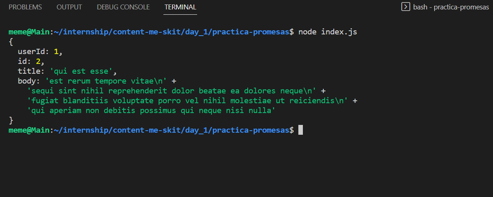
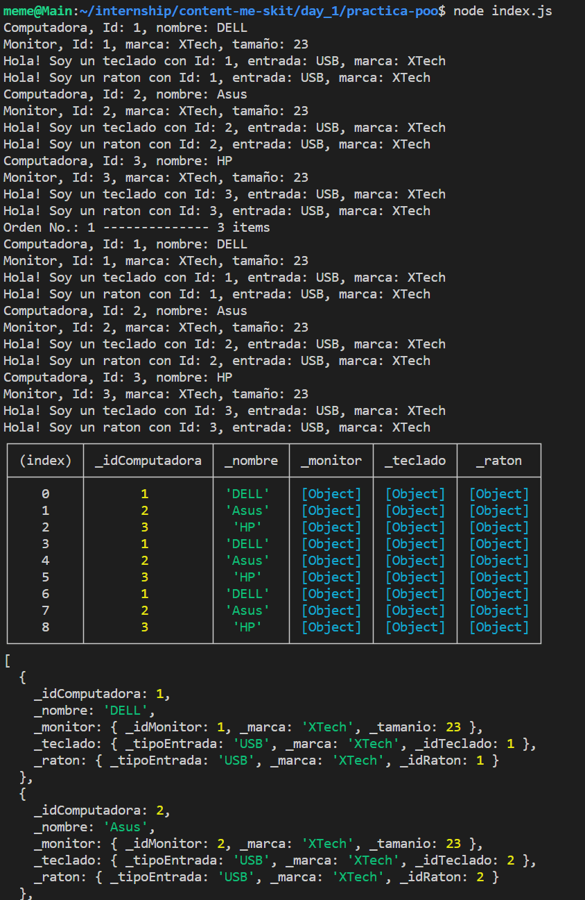

# JS Basico

En esta práctica realizamos ejercicios sobre Promises y Clases en JavaScript en las correspondientes carpetas:

- practica-promesas
- practica-poo

## Ejemplos de Ejecución

### Promesas

Realizamos solicitudes HTTP a los end-points:
- 'https://flagcdn.com/es/codes.json'
- 'https://jsonplaceholder.typicode.com/posts/' con y sin parametros.

#### Código

```
const requester = new RequestMaker();
requester.makeRequestWithRace();
```

#### Salida



### POO:

#### Código

```
let nuevoRaton = new Raton(raton1);
let nuevoTeclado = new Teclado(teclado1);
let nuevoMonitor = new Monitor(monitor1);
let nuevaCompu1 = new Computadora("DELL", nuevoMonitor, nuevoRaton, nuevoTeclado);

nuevoRaton = new Raton(raton1);
nuevoTeclado = new Teclado(teclado1);
nuevoMonitor = new Monitor(monitor1);
let nuevaCompu2 = new Computadora("Asus", nuevoMonitor, nuevoRaton, nuevoTeclado);

nuevoRaton = new Raton(raton1);
nuevoTeclado = new Teclado(teclado1);
nuevoMonitor = new Monitor(monitor1);
let nuevaCompu3 = new Computadora("HP", nuevoMonitor, nuevoRaton, nuevoTeclado);

const nuevaOrden = new Orden();
nuevaOrden.agregarComputadora(nuevaCompu1);
nuevaOrden.agregarComputadora(nuevaCompu2);
nuevaOrden.agregarComputadora(nuevaCompu3);
nuevaOrden.mostrarOrden();
nuevaOrden.showData();
```

#### Salida

